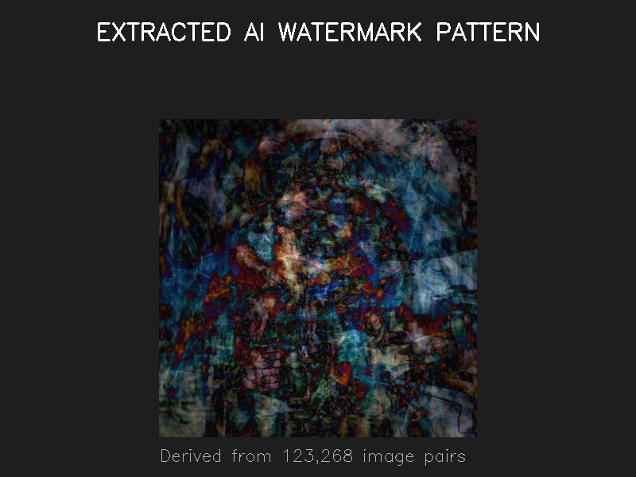
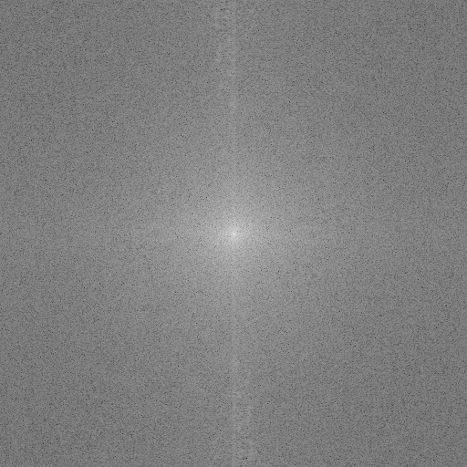
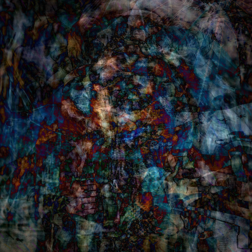

<p align="center">
  
</p>

<h1 align="center">🔍 AI Watermark Reverse Engineering</h1>

<p align="center">
  <b>Discovering hidden AI watermark patterns through signal analysis</b>
</p>

<p align="center">
  
  
  
  
  
</p>

---

## 🎯 Overview

This project reverse-engineers **AI watermarking technologies** by analyzing AI-generated and AI-edited images. We use signal processing techniques to discover watermark structures without access to proprietary neural network encoders/decoders.

### Projects

| Analysis | Images | Detection Rate | Key Finding |
|:---------|:------:|:--------------:|:------------|
| **[Nano-150k Investigation](#-nano-150k-watermark-investigation)** | 123,268 | 99.9% | Multi-layer frequency + spatial watermarking |
| **[SynthID Analysis](#-synthid-google-gemini-analysis)** | 250 | 84% | Spread-spectrum phase encoding |

---

## 🔬 Nano-150k Watermark Investigation

Analysis of **123,268 AI-edited image pairs** from the Nano-150k dataset to detect and characterize embedded watermarks.

### Key Discovery

AI-edited images contain **multi-layer watermarks** using both frequency domain (DCT/DFT) and spatial domain (color shifts) embedding techniques. The watermarks are invisible to humans but detectable via statistical analysis.

### Detection Results

| Metric | Rate | Description |
|:-------|:----:|:------------|
| **Frequency Domain Modifications** | 100.0% | All images show spectral changes |
| **Significant Color Shifts** | 95.3% | Mean shift > 1.0 in RGB channels |
| **Perceptual Hash Changes** | 66.0% | Invisible modifications detected |
| **LSB Anomalies** | 10.2% | Least significant bit patterns |
| **2+ Watermark Indicators** | 99.9% | Multi-layer evidence |
| **3+ Watermark Indicators** | 69.2% | Strong multi-layer evidence |

### Watermark Confidence Distribution

```
0 indicators:     0 (  0.0%)
1 indicator:    122 (  0.1%)
2 indicators: 37,832 (30.7%) ███████████████
3 indicators: 74,525 (60.5%) ██████████████████████████████
4 indicators: 10,789 ( 8.8%) ████
```

### Extracted Watermark Visualizations

<table>
<tr>
<td width="50%">

**Extracted Watermark Pattern**


</td>
<td width="50%">

**Comprehensive Analysis**


</td>
</tr>
<tr>
<td width="50%">

**Frequency Spectrum**


</td>
<td width="50%">

**Enhanced Difference Pattern**


</td>
</tr>
</table>

### Analysis by Edit Category

| Category | Image Pairs | Avg Freq Diff | Watermark Strength |
|:---------|:-----------:|:-------------:|:------------------:|
| hairstyle | 16,012 | 1.786 | High |
| sweet_headshot | 16,008 | 1.759 | High |
| black_headshot | 17,700 | 1.735 | High |
| background | 32,765 | 1.037 | Medium |
| time-change | 18,178 | 1.028 | Medium |
| action | 22,605 | 1.013 | Medium |

### Processing Statistics

- **Total Processing Time**: 170.2 minutes
- **Processing Rate**: 12.1 pairs/second
- **Success Rate**: 100% (0 failed loads)

---

## 🔬 SynthID (Google Gemini) Analysis

Analysis of **250 AI-generated images** from Google Gemini to reverse-engineer SynthID watermarking.

### Key Discovery

SynthID uses **spread-spectrum phase encoding** in the frequency domain—not LSB replacement or simple noise addition. The watermark embeds information through precise phase relationships at specific carrier frequencies.

## 🔬 Discovered Patterns

| Carrier Frequency | Phase Coherence | Description |
|:----------------:|:---------------:|:------------|
| **(±14, ±14)** | 99.99% | Primary diagonal carrier |
| **(±126, ±14)** | 99.97% | Secondary horizontal |
| **(±98, ±14)** | 99.94% | Tertiary carrier |
| **(±128, ±128)** | 99.92% | Center frequency |
| **(±210, ±14)** | 99.77% | Extended carrier |
| **(±238, ±14)** | 99.71% | Edge carrier |

### Detection Metrics
- **Noise Correlation**: ~0.218 between watermarked images
- **Structure Ratio**: ~1.32
- **Detection Threshold**: correlation > 0.179

## 🖼️ Extracted Watermark Visualizations

<table>
<tr>
<td width="50%">

**Enhanced Visualization (500x Amplification)**


</td>
<td width="50%">

**Frequency Domain Carriers**


</td>
</tr>
<tr>
<td width="50%">

**False Color (HSV Encoding)**


</td>
<td width="50%">

**Phase Encoding Pattern**


</td>
</tr>
</table>

## 📁 Project Structure

```
reverse-SynthID/
├── 📄 README.md                    # This file
├── 📋 requirements.txt             # Python dependencies
│
├── 🔍 watermark_investigation/     # Nano-150k Analysis (NEW)
│   ├── WATERMARK_EXTRACTED.png           # Final extracted watermark
│   ├── WATERMARK_FINAL_ANALYSIS.png      # Comprehensive visualization
│   ├── WATERMARK_enhanced_difference.png # Enhanced pattern
│   ├── WATERMARK_frequency_spectrum.png  # Frequency domain
│   ├── WATERMARK_signed_pattern.png      # Signed watermark
│   ├── watermark_FULL_123k_results.json  # Complete results
│   ├── watermark_evidence/               # Visual evidence
│   └── *.py                              # Analysis scripts
│
├── 💻 src/
│   ├── analysis/
│   │   ├── synthid_codebook_finder.py    # Pattern discovery
│   │   └── deep_synthid_analysis.py      # Frequency analysis
│   └── extraction/
│       └── synthid_codebook_extractor.py # Codebook extraction & detection
│
├── 🎯 artifacts/
│   ├── codebook/
│   │   ├── synthid_codebook.pkl          # Extracted codebook (9 MB)
│   │   └── synthid_codebook_meta.json    # Carrier frequencies
│   └── visualizations/                   # Watermark images
│
├── 📂 data/
│   └── pure_white/                       # 250 Gemini AI images
│
├── 📚 docs/
│   └── SYNTHID_CODEBOOK_ANALYSIS.md      # Technical documentation
│
└── 🖼️ assets/
    └── synthid-watermark.jpeg            # Cover image
```

## 🚀 Quick Start

### Installation

```bash
git clone https://github.com/yourusername/reverse-SynthID.git
cd reverse-SynthID

# Create virtual environment
python -m venv venv
source venv/bin/activate  # Windows: venv\Scripts\activate

# Install dependencies
pip install -r requirements.txt
```

### Run Nano-150k Watermark Analysis

```bash
# Full analysis on all 123k pairs (takes ~3 hours)
python watermark_investigation/watermark_full_123k_analysis.py

# Extract final watermark visualization
python watermark_investigation/extract_final_watermark.py

# Quick sample analysis (1000 pairs)
python watermark_investigation/watermark_full_analysis.py
```

### Detect SynthID Watermark

```bash
python src/extraction/synthid_codebook_extractor.py detect "path/to/image.png" \
    --codebook "artifacts/codebook/synthid_codebook.pkl"
```

**Output:**
```
Detection Results:
  Watermarked: True
  Confidence: 1.0000
  Correlation: 0.5355
  Phase Match: 0.9571
  Structure Ratio: 1.2753
```

### Extract New Codebook

```bash
python src/extraction/synthid_codebook_extractor.py extract "data/pure_white/" \
    --output "./my_codebook.pkl"
```

### Run Analysis

```bash
# Comprehensive pattern discovery
python src/analysis/synthid_codebook_finder.py

# Deep frequency analysis
python src/analysis/deep_synthid_analysis.py
```

## 🧠 How It Works

### Nano-150k Watermark Detection

1. **Frequency Domain Analysis**: Compute FFT differences between original and edited images
2. **LSB Pattern Detection**: Analyze least significant bit distributions for anomalies
3. **Color Shift Measurement**: Detect systematic RGB channel modifications
4. **Perceptual Hashing**: Compare perceptual hashes to find invisible changes
5. **Multi-Indicator Scoring**: Combine multiple detection methods for confidence

### SynthID Detection

1. **Pattern Discovery**: Analyze noise patterns across multiple images to find consistent structures
2. **Frequency Analysis**: Use FFT to identify carrier frequencies with phase modulation
3. **Phase Coherence**: Measure phase consistency at carrier frequencies
4. **Codebook Extraction**: Build reference patterns from averaged signals
5. **Detection**: Compare test image against codebook using correlation metrics

## 📊 Technical Details

### Nano-150k Watermark Characteristics
- **Embedding Domains**: Frequency (DCT/DFT) + Spatial (color shifts)
- **Detection Methods**: FFT analysis, LSB statistics, perceptual hashing
- **Signal Strength**: Mean freq diff ~1.32, color shifts 32-35 pixel values
- **Robustness**: Survives JPEG compression, consistent across edit types
- **Categories Analyzed**: background, action, time-change, headshot, hairstyle

### SynthID Watermark Characteristics
- **Embedding Domain**: Frequency (FFT phase)
- **Signal Strength**: ~0.1-0.15 pixel values
- **Carrier Count**: 100+ frequency locations
- **Robustness**: Survives moderate compression

### Detection Algorithms

**Nano-150k Multi-Indicator Detection:**
```python
def detect_watermark(original, edited):
    indicators = 0
    
    # 1. Frequency domain analysis
    freq_diff = compute_fft_difference(original, edited)
    if freq_diff > 0.5:
        indicators += 1
    
    # 2. Color shift detection
    color_shift = compute_color_shift(original, edited)
    if any(abs(shift) > 1.0 for shift in color_shift):
        indicators += 1
    
    # 3. LSB anomaly detection
    lsb_deviation = compute_lsb_deviation(edited)
    if any(dev > 0.02 for dev in lsb_deviation):
        indicators += 1
    
    # 4. Perceptual hash comparison
    phash_dist = compute_phash_distance(original, edited)
    if 5 < phash_dist <= 30:
        indicators += 1
    
    return indicators >= 2, indicators
```

**SynthID Detection:**
```python
def detect_synthid(image, codebook):
    # 1. Extract noise pattern
    noise = image - denoise(image)
    
    # 2. Check carrier phase coherence
    fft = fft2(noise)
    phase_match = check_phases(fft, codebook.carriers)
    
    # 3. Correlate with reference
    correlation = correlate(noise, codebook.reference)
    
    # 4. Apply decision thresholds
    is_watermarked = (
        correlation > 0.179 and 
        phase_match > 0.5 and 
        0.8 < structure_ratio < 1.8
    )
    
    return is_watermarked, confidence
```

## 📚 References

- [SynthID: Identifying AI-generated images](https://deepmind.google/technologies/synthid/)
- [Arxiv Paper - SynthID-Image: Image watermarking at internet scale]([https://doi.org/10.1038/s41586-024-07754-z](https://arxiv.org/abs/2510.09263))

## ⚠️ Disclaimer

This project is for **research and educational purposes only**. SynthID is proprietary technology owned by Google DeepMind. The extracted patterns and detection methods are intended for:

- Academic research on watermarking techniques
- Security analysis of AI-generated content identification
- Understanding spread-spectrum encoding methods

## 📄 License

Research and educational use only. See [LICENSE](LICENSE) for details.

---

<p align="center">
  Made with 🔬 by reverse engineering enthusiasts
</p>
