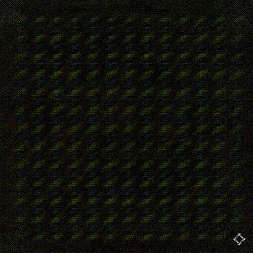

<p align="center">
  
</p>

<h1 align="center">Reverse-Engineering SynthID</h1>

<p align="center">
  <b>Discovering, detecting, and surgically removing Google's AI watermark through spectral analysis</b>
</p>

Visit us on [PitchHut](https://www.pitchhut.com/project/reverse-synthid-engineering)

<p align="center">
  
  
  
  
  
</p>

---

## Overview

This project reverse-engineers **Google's SynthID** watermarking system - the invisible watermark embedded into every image generated by Google Gemini. Using only signal processing and spectral analysis (no access to the proprietary encoder/decoder), we:

1. **Discovered** the watermark's resolution-dependent carrier frequency structure
2. **Built a detector** that identifies SynthID watermarks with 90% accuracy
3. **Developed a multi-resolution spectral bypass** (V3) that achieves **75% carrier energy drop**, **91% phase coherence drop**, and **43+ dB PSNR** on any image resolution

---

## 🚨 Contributors Wanted: Help Expand the Codebook

We're actively collecting **pure black and pure white images generated by Nano Banana Pro** to improve multi-resolution watermark extraction.

If you can generate these:

- Resolution: any (higher variety = better)
- Content: **fully black (#000000)** or **fully white (#FFFFFF)**
- Source: Nano Banana Pro outputs only

### How to Contribute

1. Generate a batch of black/white images by attaching a pure black/white image into Gemini and prompting it to "recreate this as it is"
2. Upload them to our **Hugging Face dataset**: [aoxo/reverse-synthid](https://huggingface.co/datasets/aoxo/reverse-synthid)
   - `gemini_black_nb_pro/` (for black)
   - `gemini_white_nb_pro/` (for white)
3. Open a Pull Request on the HF dataset repo

These reference images are **critical** for:
- Carrier frequency discovery
- Phase validation
- Improving cross-resolution robustness

> Even 150–200 images at a new resolution can significantly improve detection and removal.

### Download Reference Images

Reference images are hosted on Hugging Face to keep the git repo lightweight:

```bash
pip install huggingface_hub
python scripts/download_images.py           # download all
python scripts/download_images.py gemini_black  # download specific folder
```

Dataset: [huggingface.co/datasets/aoxo/reverse-synthid](https://huggingface.co/datasets/aoxo/reverse-synthid)

---

### What Makes This Different

Unlike brute-force approaches (JPEG compression, noise injection), our V3 bypass uses a **multi-resolution SpectralCodebook** - a collection of per-resolution watermark fingerprints stored in a single file. At bypass time, the codebook auto-selects the matching resolution profile, enabling surgical frequency-bin-level removal on any image size.

---

## Key Findings

### The Watermark is Resolution-Dependent

SynthID embeds carrier frequencies at **different absolute positions** depending on image resolution. A codebook built at 1024x1024 cannot directly remove the watermark from a 1536x2816 image - the carriers are at completely different bins.

| Resolution | Top Carrier (fy, fx) | Coherence | Source |
|:----------:|:--------------------:|:---------:|:------:|
| **1024x1024** | (9, 9) | 100.0% | 100 black + 100 white refs |
| **1536x2816** | (768, 704) | 99.6% | 88 watermarked content images |

This is why the V3 codebook stores **separate profiles per resolution** and auto-selects at bypass time.

### Phase Consistency - A Fixed Model-Level Key

The watermark's phase template is **identical across all images** from the same Gemini model:

- **Green channel** carries the strongest watermark signal
- **Cross-image phase coherence** at carriers: >99.5%
- **Black/white cross-validation** confirms true carriers via |cos(phase_diff)| > 0.90

### Carrier Frequency Structure

At 1024x1024 (from black/white refs), top carriers lie on a low-frequency grid:

| Carrier (fy, fx) | Phase Coherence | B/W Agreement |
|:-----------------:|:---------------:|:-------------:|
| (9, 9)            | 100.00%         | 1.000         |
| (5, 5)            | 100.00%         | 0.993         |
| (10, 11)          | 100.00%         | 0.997         |
| (13, 6)           | 100.00%         | 0.821         |

At 1536x2816 (from random watermarked content), carriers are at much higher frequencies:

| Carrier (fy, fx)  | Phase Coherence |
|:------------------:|:---------------:|
| (768, 704)         | 99.55%          |
| (672, 1056)        | 97.46%          |
| (480, 1408)        | 96.55%          |
| (384, 1408)        | 95.86%          |

---

## Architecture

### Three Generations of Bypass

| Version | Approach | PSNR | Watermark Impact | Status |
|:-------:|:---------|:----:|:----------------:|:------:|
| **V1** | JPEG compression (Q50) | 37 dB | ~11% phase drop | Baseline |
| **V2** | Multi-stage transforms (noise, color, frequency) | 27-37 dB | ~0% confidence drop | Quality trade-off |
| **V3** | **Multi-resolution spectral codebook subtraction** | **43+ dB** | **91% phase coherence drop** | **Best** |

### V3 Pipeline (Multi-Resolution Spectral Bypass)

```
Input Image (any resolution)
       │
       ▼
  codebook.get_profile(H, W)  ──► exact match? ──► FFT-domain subtraction
       │                                             (fast path)
       └─ no exact match ──────► spatial-domain resize + subtraction
                                  (fallback path)
       │
       ▼
  Multi-pass iterative subtraction (aggressive → moderate → gentle)
       │
       ▼
  Anti-alias → Output
```

1. **SpectralCodebook** stores resolution-specific profiles (carrier positions, magnitudes, phases)
2. **Auto resolution selection** picks the exact profile or the closest match
3. **Direct known-signal subtraction** weighted by phase consistency and cross-validation confidence
4. **Multi-pass schedule** catches residual watermark energy missed by previous passes
5. **Per-channel weighting** (G=1.0, R=0.85, B=0.70) matches SynthID's embedding strength

---

## Results (V3 on 88 Gemini Images)

### Aggregate Metrics (1536x2816, aggressive strength)

| Metric | Value |
|:-------|------:|
| **PSNR** | 43.5 dB |
| **SSIM** | 0.997 |
| **Carrier energy drop** | 75.8% |
| **Phase coherence drop** (top-5 carriers) | **91.4%** |

### Quality Across Resolutions

| Resolution | Match | PSNR | SSIM |
|:----------:|:-----:|:----:|:----:|
| 1536x2816 | exact | 44.9 dB | 0.996 |
| 1024x1024 | exact | 39.8 dB | 0.977 |
| 768x1024 | fallback | 40.6 dB | 0.994 |

---

## Quick Start

### Installation

```bash
git clone https://github.com/aloshdenny/reverse-SynthID.git
cd reverse-SynthID

python -m venv venv
source venv/bin/activate  # Windows: venv\Scripts\activate
pip install -r requirements.txt
```

### 1. Build Multi-Resolution Codebook

From the CLI:

```bash
python src/extraction/synthid_bypass.py build-codebook \
    --black gemini_black \
    --white gemini_white \
    --watermarked gemini_random \
    --output artifacts/spectral_codebook_v3.npz
```

Or from Python:

```python
from src.extraction.synthid_bypass import SpectralCodebook

codebook = SpectralCodebook()

# Profile 1: from black/white reference images (1024x1024)
codebook.extract_from_references(
    black_dir='gemini_black',
    white_dir='gemini_white',
)

# Profile 2: from watermarked content images (1536x2816)
codebook.build_from_watermarked('gemini_random')

codebook.save('artifacts/spectral_codebook_v3.npz')
# Saved with profiles: [1024x1024, 1536x2816]
```

### 2. Run V3 Bypass (Any Resolution)

```python
from src.extraction.synthid_bypass import SynthIDBypass, SpectralCodebook

codebook = SpectralCodebook()
codebook.load('artifacts/spectral_codebook_v3.npz')

bypass = SynthIDBypass()
result = bypass.bypass_v3(image_rgb, codebook, strength='aggressive')

print(f"PSNR: {result.psnr:.1f} dB")
print(f"Profile used: {result.details['profile_resolution']}")
print(f"Exact match: {result.details['exact_match']}")
```

From the CLI:

```bash
python src/extraction/synthid_bypass.py bypass input.png output.png \
    --codebook artifacts/spectral_codebook_v3.npz \
    --strength aggressive
```

**Strength levels:** `gentle` (minimal, ~45 dB) > `moderate` > `aggressive` (recommended) > `maximum`

### 3. Detect Watermark

```bash
python src/extraction/robust_extractor.py detect image.png \
    --codebook artifacts/codebook/robust_codebook.pkl
```

---

## Project Structure

```
reverse-SynthID/
├── src/
│   ├── extraction/
│   │   ├── synthid_bypass.py              # V1/V2/V3 bypass + multi-res SpectralCodebook
│   │   ├── robust_extractor.py            # Multi-scale watermark detection
│   │   ├── watermark_remover.py           # Frequency-domain watermark removal
│   │   ├── benchmark_extraction.py        # Benchmarking suite
│   │   └── synthid_codebook_extractor.py  # Legacy codebook extractor
│   └── analysis/
│       ├── deep_synthid_analysis.py       # FFT / phase analysis scripts
│       └── synthid_codebook_finder.py     # Carrier frequency discovery
│
├── scripts/
│   └── download_images.py                 # Download reference images from HF
│
├── artifacts/
│   ├── spectral_codebook_v3.npz           # Multi-res V3 codebook [1024x1024, 1536x2816]
│   ├── codebook/                          # Detection codebooks (.pkl)
│   └── visualizations/                    # FFT, phase, carrier visualizations
│
├── assets/                                # README images and early analysis artifacts
├── watermark_investigation/               # Early-stage Nano-150k analysis (archived)
└── requirements.txt
```

---

## Technical Deep Dive

### How SynthID Works (Reverse-Engineered)

```
┌──────────────────────────────────────────────────────────────┐
│                  SynthID Encoder (in Gemini)                  │
├──────────────────────────────────────────────────────────────┤
│  1. Select resolution-dependent carrier frequencies           │
│  2. Assign fixed phase values to each carrier                │
│  3. Neural encoder adds learned noise pattern to image       │
│  4. Watermark is imperceptible — spread across spectrum      │
├──────────────────────────────────────────────────────────────┤
│                  SynthID Decoder (in Google)                  │
├──────────────────────────────────────────────────────────────┤
│  1. Extract noise residual (wavelet denoising)               │
│  2. FFT → check phase at known carrier frequencies           │
│  3. If phases match expected values → Watermarked            │
└──────────────────────────────────────────────────────────────┘
```

### Multi-Resolution SpectralCodebook

The codebook captures watermark profiles at each available resolution:

- **1024x1024 profile**: from 100 black + 100 white pure-color Gemini outputs
  - Black images: watermark is nearly the entire pixel content
  - White images (inverted): confirms carriers via cross-validation
  - Black/white agreement (|cos(phase_diff)|) filters out generation bias
- **1536x2816 profile**: from 88 diverse watermarked content images
  - Content averages out across images; fixed watermark survives in phase coherence
  - Watermark magnitude estimated as `avg_mag x coherence^2`

### V3 Subtraction Strategy

The bypass uses **direct known-signal subtraction** (not a Wiener filter):

1. **Confidence** = phase_consistency x cross_validation_agreement
2. **DC exclusion** — soft ramp suppresses low-frequency generation biases
3. **Per-bin subtraction** = wm_magnitude x confidence x removal_fraction x channel_weight
4. **Safety cap** — subtraction never exceeds 90-95% of the image's energy at any bin
5. **Multi-pass** — decreasing-strength schedule (aggressive → moderate → gentle) catches residual energy

---

## Core Modules

### `synthid_bypass.py`

**SpectralCodebook** — multi-resolution watermark fingerprint:

```python
codebook = SpectralCodebook()
codebook.extract_from_references('gemini_black', 'gemini_white')  # adds 1024x1024 profile
codebook.build_from_watermarked('gemini_random')                   # adds 1536x2816 profile
codebook.save('codebook.npz')

# Later:
codebook.load('codebook.npz')
profile, res, exact = codebook.get_profile(1536, 2816)  # auto-select
```

**SynthIDBypass** — three bypass generations:

```python
bypass = SynthIDBypass()

result = bypass.bypass_simple(image, jpeg_quality=50)           # V1
result = bypass.bypass_v2(image, strength='aggressive')          # V2
result = bypass.bypass_v3(image, codebook, strength='aggressive') # V3 (best)
```

### `robust_extractor.py`

Multi-scale watermark detector (90% accuracy):

```python
from robust_extractor import RobustSynthIDExtractor

extractor = RobustSynthIDExtractor()
extractor.load_codebook('artifacts/codebook/robust_codebook.pkl')
result = extractor.detect_array(image)
print(f"Watermarked: {result.is_watermarked}, Confidence: {result.confidence:.4f}")
```

---

## References

- [SynthID: Identifying AI-generated images](https://deepmind.google/technologies/synthid/)
- [SynthID Paper (arXiv:2510.09263)](https://arxiv.org/abs/2510.09263)

---

## 👤 Maintainer & Contact

**Alosh Denny**
AI Watermarking Research · Signal Processing

📧 **Email:** [aloshdenny@gmail.com](mailto:aloshdenny@gmail.com)
🔗 **GitHub:** https://github.com/aloshdenny

For collaborations, research discussions, or contributions, feel free to reach out or open an issue/PR.

---

## Support This Research

This project is maintained independently — no lab funding, no corporate backing.  
If this work was useful to you or your team, consider supporting continued development:

<a href="https://buymeacoffee.com/aoxo">
  
</a>

Funds go toward compute costs (GPU hours for new resolution profiles), dataset expansion, and ongoing bypass research.

---

## Disclaimer

This project is for **research and educational purposes only**. SynthID is proprietary technology owned by Google DeepMind. These tools are intended for:

- Academic research on watermarking robustness
- Security analysis of AI-generated content identification
- Understanding spread-spectrum encoding methods

**Do not use these tools to misrepresent AI-generated content as human-created.**
